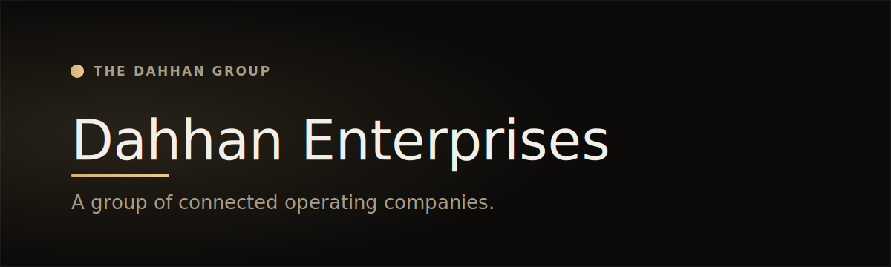

  

  
  
  

# Dahhan Enterprises

> **An international business group — business & digital transformation across a family of connected operating brands.**

Dahhan Enterprises is an international business group with commercial roots dating back to **1990**. The group operates across **business and digital transformation, technology services, commerce, textiles, apparel, e-commerce, B2B wholesale, and commercial trade**.

The current U.S. company, **Dahhan Enterprises LLC**, was established in **2026** to support international expansion, digital operations, and the development of a connected business infrastructure across the group.

## Operating brands

Dahhan Enterprises brings together multiple operating brands and business lines:

| Brand | Focus |
|---|---|
| **[Dahhan Industries](https://github.com/M1D0-Technologies/dahhan-industries)** | B2B wholesale and commercial trade — industrial textile manufacturing, OEM & private-label supply |
| **[Miss Dantella](https://github.com/M1D0-Technologies/miss-dantella)** | Textiles, apparel, intimate apparel and e-commerce — lace, lingerie, elastic and accessories |
| **[M1D0 Technologies](https://github.com/M1D0-Technologies/m1d0-technologies)** | Technology services, software systems, automation, web infrastructure and digital transformation |

Additional brands and business lines are introduced as the group grows.

## What we do

The company helps **small and medium-sized businesses modernize operations** — through strategy, software, automation, systems integration, web platforms, and business-process improvement.

Our work is built around **one connected operating model**: combining business strategy, technology execution, operational structure, commerce, and long-term brand development into scalable company systems.

## What this surface is — and isn't

- ✅ A credible, long-term identity for the group
- ✅ A brief introduction to each operating brand, linking out to its own site
- ✅ One trusted contact surface for partnership, investor, press, and corporate enquiries
- ❌ Not a catalog, webshop, or marketing funnel — and it never adopts a child brand's visual identity

## Tech stack

  
  
  
  

Next.js · React · TypeScript · Tailwind CSS · multilingual (EN / TR / AR) · self-hosted behind a hardened edge. Deliberately restrained, institutional design — no gimmicks, no borrowed brand surface.

## Links

- 🌐 **Live:** [dahhanenterprises.com](https://www.dahhanenterprises.com) &nbsp;·&nbsp; 🟡 *Launching soon*
- 🏛️ **Group on GitHub:** [M1D0-Technologies](https://github.com/M1D0-Technologies)
- ✉️ **Enquiries:** info@dahhanenterprises.com

---

Built and operated by **M1D0 Technologies**, the group's technology practice. Documentation-only showcase — product source is private. © 2026 Dahhan Enterprises LLC — M1D0 Technologies, Dahhan Industries, Miss Dantella and affiliated brands. All rights reserved.
